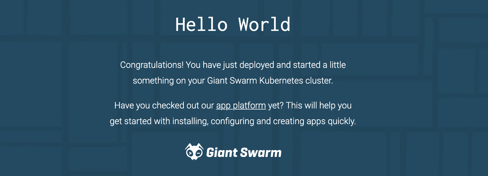

# Provision an EKS Cluster

This repo helps you quickly create EKS (Kubernetes) clusters in AWS for your software development / testing. The clusters include a `hello world` web application. 

To create your cluster(s), you'll clone this repo to your computer, and run some commands in Terraform and the AWS CLI. Be sure to scroll all the way to the end to learn how to [clean up your clusters](#cleanup-your-clusters). That's super important - forgetting this step can be very **expensive $$$$**!

> This repo started as a fork of [learn-terraform-provision-eks-cluster](https://github.com/hashicorp-education/learn-terraform-provision-eks-cluster).

Contents
1. [Prerequisites](#prerequisites)
1. [Create Your First Cluster](#create-your-first-cluster)
1. [Create More Clusters](#create-more-clusters)
1. [Clean Up Your Clusters](#clean-up-your-clusters)

# Prerequisites

Before creating your EKS cluster in AWS, you'll need the following.

1. The Kubernetes CLI, `kubectl`, installed on your computer - follow [these steps](https://kubernetes.io/docs/tasks/tools/) for your OS. 
1. An AWS account. If you don't already have one, you'll just need a credit card, and you can follow [these quick steps](https://aws.amazon.com/resources/create-account/).
1. The AWS CLI installed on your computer - follow [these steps](https://docs.aws.amazon.com/cli/latest/userguide/getting-started-install.html) for your OS.
1. The AWS CLI should be configured with administrator-level credentials to your AWS account.

Check whether your AWS CLI is already configured: `aws sts get-caller-identity`

If it is not configured, or if you're not sure whether or not the creds are **administrator**-level, follow [these steps](docs/aws-credentials.md)

# Create Your First Cluster

#### 1. Clone this repo
```shell
git clone https://github.com/TedSpinks/play-eks-cluster.git
cd play-eks-cluster
```

#### 2. Edit main.tf 

Edit the main.tf file in the root of the repo. Be careful - there are also main.tf files in the subdirectories, but we want to edit the one [in the root](main.tf).
```
module "eks_cluster_example1" {
  cluster_name = "example1"
  source       = "./modules/eks_cluster"
  region       = "us-east-2"
}
```
Update the first 2 lines with whatever name you want to give your cluster (alphanumeric, lower case). For example, if I want to call my cluster `ted1`, I would update it as follows:
```
module "eks_cluster_ted1" {
  cluster_name = "ted1"
  source       = "./modules/eks_cluster"
  region       = "us-east-2"
}
```

#### 3. Create the cluster with Terraform commands
```shell
terraform init 
terraform apply
```
When it asks `Do you want to perform these actions?` type `yes` and press ENTER. 

It should run for 15 or so minutes. When Terraform completes it should say something like:
```
Apply complete! Resources: 60 added, 0 changed, 0 destroyed.
```
Your cluster is ready!

#### 4. Connect to your cluster

Use the AWS CLI to connect `kubectl` to your cluster. Replace `ted1` and `us-east-2` with the name and region of your cluster.
```shell
aws eks update-kubeconfig --name ted1 --region us-east-2
```

#### 5. Connect to the Hello World app

Use `kubectl` to get the DNS name of our Hello World app.
```shell
kubectl get svc hello-world-app
```

The output should look something like this. We need the `EXTERNAL-IP` field.
```
NAME             TYPE          CLUSTER-IP     EXTERNAL-IP                                               PORT(S)
hello-world-app  LoadBalancer  172.20.74.137  acf43e748sdd5fde2e5f-8145582.us-east-2.elb.amazonaws.com  80:30946/TCP
```

In your browser's URL bar, enter the `EXTERNAL-IP`.


# Create more Clusters

To create more clusters, edit your main.tf. Copy the `module` block, and update it to include the name of the new cluster. Be sure to leave the original `module` block alone. For example, if my original cluster was `ted1` and my second cluster is `ted2`, I would edit my main.tf like this:
```text
module "eks_cluster_ted1" {
  cluster_name = "ted1"
  source       = "./modules/eks_cluster"
  region       = "us-east-2"
}

module "eks_cluster_ted2" {
  cluster_name = "ted2"
  source       = "./modules/eks_cluster"
  region       = "us-east-2"
}
```

Repeat [steps 3](#3-create-the-cluster-with-terraform-commands) through 5 above to create the new cluster and connect to its Hello World app.

# Clean Up Your Clusters

Be sure to delete your cluster(s) when you're done! Running things in AWS can get very expensive!!

Run Terraform from the root of your repo to clean up your clusters.
```shell
terraform destroy
```
When is asks `Do you really want to destroy all resources?` type `yes` and press ENTER. It should run for a few minutes and then say something like:
```
Destroy complete! Resources: 60 destroyed.
```

If you get errors, be sure you are running terraform for the root of the cloned Git repo.
