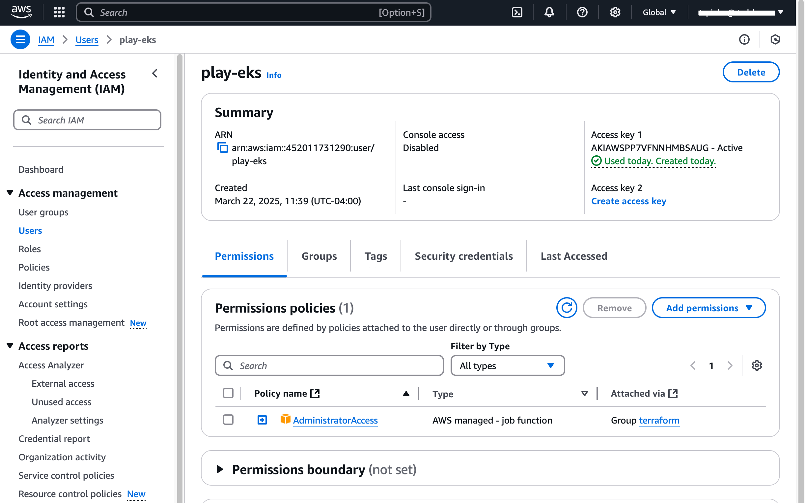

# Create AWS administrator-level credential

In order to create all the different resources needed by your EKS cluster, your AWS CLI should be configured with ***administrator-level*** credentials. The credentials will consist of 3 values, named as follows:
```shell
AWS_ACCESS_KEY_ID: Your AWS access key ID.
AWS_SECRET_ACCESS_KEY: Your AWS secret access key.
AWS_REGION: Your AWS region.
```

If you are using your company's AWS account, you can ask your AWS administrator to help you get these credentials.

If you are using an individual/personal AWS account, you can follow the steps below to create the needed credentials. 

## 1. Check whether your AWS CLI is already configured.

Run the following command:
```shell
aws sts get-caller-identity
```
It should give results similar to this:
```json
{
    "UserId": "11111111",
    "Account": "222222222",
    "Arn": "arn:aws:iam::222222222:user/play-eks"
}
```
If the `Arn` indicates an IAM user or Role that you know has administrator-level permissions, then you're done! If not, read on...

## 2. Create an IAM User

In the AWS console, create an IAM user to use for Terraform.

1. At the AWS console search bar, type `iam` and click into the IAM page 
1. From the navigation pane on the left, click **Users**, and then at the top right, click **Create User**
1. Enter a name for the account 
1. Click the radio button for **Attach policies directly** and then add `AdministratorAccess` 
1. Finish creating the account 
1. Drill into the new account, it should look like this 
1. Click on the **Security credentials** tab 
1. Click **Create access key** 
1. Choose **Other** and click **Next** 
1. Finish creating the access key, and be sure to save the 3 resulting values. We'll need them for the next step.
```shell
AWS_ACCESS_KEY_ID: Your AWS access key ID.
AWS_SECRET_ACCESS_KEY: Your AWS secret access key.
AWS_REGION: Your AWS region.
```

## 3. Configure the AWS CLI.

Configure the AWS ClI, entering the 3 access key values when prompted.
```shell
aws configure
```

Verify that your new configuration works.
```shell
aws sts get-caller-identity
```

It should give results similar to this:
```json
{
    "UserId": "11111111",
    "Account": "222222222",
    "Arn": "arn:aws:iam::222222222:user/play-eks"
}
```
The `Arn` should refer the IAM account you previously created. If you get an error, run `aws configure` again, and double check that ***all 3*** values are correct.
